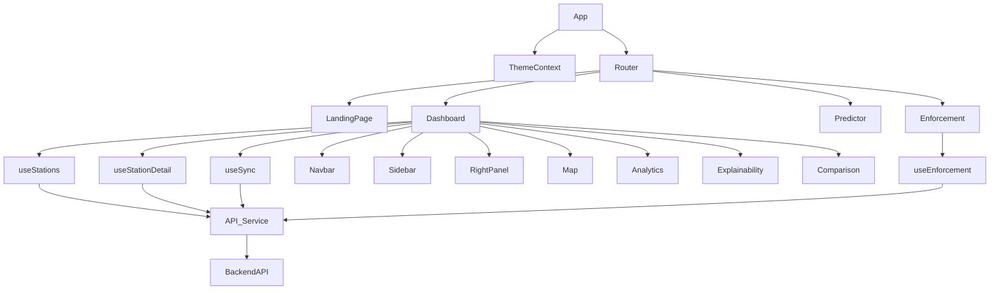
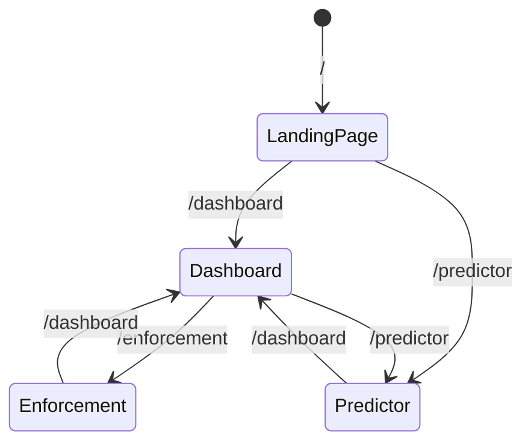

# Design Document: AtmosEdgeAI Frontend Refactor

## Overview

The refactor transforms a monolithic Vite + React 19 application into a production-quality, maintainable frontend. The ~600-line `App.jsx` god component is decomposed into a thin root component, four routed page components, six custom data hooks, a context provider, reusable UI primitives, and layout components. All CDN dependencies are replaced with npm packages. All AQI logic is consolidated into a single constants module. The backend URL is driven by an environment variable. The build produces zero warnings and zero lint errors.

The stack remains unchanged: Vite + React 19 + JavaScript (no TypeScript). New runtime dependencies are `react-router-dom`, `react-leaflet`, `leaflet`, `lucide-react`, `@fontsource/inter`, and `@fontsource/jetbrains-mono`. New dev dependencies are `vitest`, `@testing-library/react`, `@testing-library/jest-dom`, and `rollup-plugin-visualizer`.

---

## Architecture

```
src/
├── main.jsx                    # Entry point — mounts App
├── App.jsx                     # ≤100 lines — providers + router only
├── App.css                     # Global design tokens, all class definitions
├── index.css                   # Body reset
│
├── constants/
│   └── aqi.js                  # Single source of truth for AQI thresholds/colors
│
├── context/
│   └── ThemeContext.jsx         # Dark/light theme state + localStorage
│
├── hooks/
│   ├── useStations.js           # Stations list fetch + memoized sorted list
│   ├── useStationDetail.js      # Per-station history, forecast, intelligence
│   ├── useEnforcement.js        # Enforcement dashboard fetch
│   └── useSync.js               # CPCB sync trigger + status polling
│
├── services/
│   └── api.js                   # All HTTP calls — reads VITE_API_URL
│
├── pages/
│   ├── LandingPage.jsx
│   ├── Dashboard.jsx
│   ├── Predictor.jsx
│   └── Enforcement.jsx
│
├── components/
│   ├── ErrorBoundary.jsx
│   ├── layout/
│   │   ├── Navbar.jsx
│   │   ├── Sidebar.jsx
│   │   └── RightPanel.jsx
│   ├── ui/
│   │   ├── Button.jsx
│   │   ├── Badge.jsx
│   │   ├── Card.jsx
│   │   ├── Skeleton.jsx
│   │   ├── Spinner.jsx
│   │   └── Banner.jsx
│   ├── map/
│   │   └── Map.jsx              # react-leaflet, in-place marker updates
│   ├── charts/
│   │   ├── Analytics.jsx        # Fixed heatmap data mapping
│   │   └── Explainability.jsx   # Real API data via hook
│   └── cards/
│       └── Comparison.jsx
│
└── utils/
    └── format.js                # Pure formatting helpers (fmt, formatTime, etc.)
```

### Component Communication Diagram



### Navigation Flow



---

## Components and Interfaces

### App.jsx (Root)

```jsx
// Renders: BrowserRouter > ThemeProvider > Suspense > Routes
// ≤100 lines, zero data fetching, zero inline styles
export default function App() {
  return (
    <ThemeProvider>
      <BrowserRouter>
        <ErrorBoundary>
          <Suspense fallback={<FullPageSpinner />}>
            <Routes>
              <Route path="/" element={<LandingPage />} />
              <Route path="/dashboard" element={<Dashboard />} />
              <Route path="/predictor" element={<Predictor />} />
              <Route path="/enforcement" element={<Enforcement />} />
              <Route path="*" element={<Navigate to="/" replace />} />
            </Routes>
          </Suspense>
        </ErrorBoundary>
      </BrowserRouter>
    </ThemeProvider>
  );
}
```

### API Service (api.js)

All functions follow this pattern:

```js
// Reads base URL from env — never hardcoded
const API_BASE = import.meta.env.VITE_API_URL + "/api";

export async function getStations(signal) {
  const r = await fetch(`${API_BASE}/stations`, { signal });
  if (!r.ok) throw new Error(`getStations failed: ${r.status} ${r.statusText}`);
  return r.json();
}
```

Callers (hooks) create the AbortController and pass the signal:

```js
// In a hook:
useEffect(() => {
  const controller = new AbortController();
  getStations(controller.signal).then(setStations).catch(handleError);
  return () => controller.abort();
}, []);
```

### Custom Hooks Interface

```js
// useStations
const { stations, loading, error, refresh } = useStations();
// stations: array (memoized, sorted by AQI descending)

// useStationDetail
const { history, forecasts, intelligence, loading, error } = useStationDetail(stationId);

// useEnforcement
const { data, loading, error } = useEnforcement();

// useSync
const { syncing, syncOk, handleSync } = useSync(onComplete);
```

### ThemeContext Interface

```jsx
// Provider:
<ThemeProvider>...</ThemeProvider>

// Consumer hook:
const { theme, toggleTheme } = useTheme();
// theme: "dark" | "light"
// toggleTheme: () => void
```

### AQI Constants Interface

```js
// src/constants/aqi.js
export const AQI_THRESHOLDS = [
  { max: 50,  slug: "good",         label: "Good",         color: "#10b981" },
  { max: 100, slug: "satisfactory", label: "Satisfactory", color: "#3b82f6" },
  { max: 200, slug: "moderate",     label: "Moderate",     color: "#f59e0b" },
  { max: 300, slug: "poor",         label: "Poor",         color: "#ef4444" },
  { max: 400, slug: "very-poor",    label: "Very Poor",    color: "#8b5cf6" },
  { max: Infinity, slug: "severe",  label: "Severe",       color: "#7c2d12" },
];

export function getAqiSlug(aqi)  { /* returns slug string */ }
export function getAqiColor(aqi) { /* returns hex color string */ }
export function getAqiLabel(aqi) { /* returns label string */ }
```

### UI Primitives Interface

```jsx
// Button
<Button variant="primary|secondary|ghost" size="sm|md" disabled onClick={fn}>Label</Button>

// Badge
<Badge variant="good|satisfactory|moderate|poor|very-poor|severe">151</Badge>

// Card
<Card className="optional-extra">children</Card>

// Skeleton
<Skeleton width="100%" height="20px" className="optional" />

// Spinner
<Spinner size="sm|md|lg" />

// Banner
<Banner variant="error|success|warning">Message text</Banner>
```

### Map Component (react-leaflet)

```jsx
// Switches from window.L CDN to react-leaflet components
// Uses useRef for marker tracking to update icons in-place
import { MapContainer, TileLayer, Marker, Popup } from "react-leaflet";
import L from "leaflet";
import "leaflet/dist/leaflet.css";

// Marker update pattern — no destroy/re-create:
useEffect(() => {
  stations.forEach(st => {
    const markerRef = markersRef.current[st.id];
    if (markerRef) {
      markerRef.setIcon(buildIcon(st, st.id === selectedStationId));
    }
  });
}, [stations, selectedStationId, activeLayer]);
```

### Analytics Heatmap Fix

Current bug: Uses `history[Math.min(history.length - 1, (dIdx * 3 + h) % history.length)]` — arbitrary index.

Fixed approach:

```js
// Build a (dayOfWeek, hour) → value lookup map from actual timestamps
const heatmapData = useMemo(() => {
  const grid = {};
  history.forEach(record => {
    const d = new Date(record.timestamp);
    const key = `${d.getDay()}-${d.getHours()}`;
    grid[key] = record[activeMetric] ?? 0;
  });
  return grid;
}, [history, activeMetric]);

// Render:
const val = heatmapData[`${dIdx}-${h}`]; // undefined if no data
const colorClass = val !== undefined ? getHeatColorClass(val) : "heat-empty";
```

### ErrorBoundary

```jsx
class ErrorBoundary extends React.Component {
  state = { hasError: false, error: null };

  static getDerivedStateFromError(error) {
    return { hasError: true, error };
  }

  componentDidCatch(error, info) {
    console.error("[ErrorBoundary]", error, info.componentStack);
  }

  render() {
    if (this.state.hasError) {
      return (
        <div className="error-boundary-fallback">
          <h3>Something went wrong</h3>
          <p>This section encountered an error. Please refresh or try again.</p>
        </div>
      );
    }
    return this.props.children;
  }
}
```

---

## Data Models

### Station (from API)

```js
{
  id: string,
  name: string,
  city: string,
  state: string,
  latitude: number,
  longitude: number,
  aqi: number,
  category: string,
  pm25: number,
  no2: number,
  temp: number,
  humidity: number,
  wind_speed: number
}
```

### StationHistory Record

```js
{
  timestamp: string,  // ISO 8601
  pm25: number,
  no2: number,
  aqi: number
}
```

### Forecast Record

```js
{
  predicted_aqi: number,
  pm25_24h: number,
  no2_24h: number,
  horizon: number,     // hours ahead
  timestamp: string
}
```

### EnforcementDashboard

```js
{
  executive_summary: {
    headline: string,
    critical_count: number,
    high_count: number,
    total_evaluated: number,
    direct_orders: string
  },
  priority_rankings: Array<{ station_name, current_aqi, trend_delta, priority, score }>,
  hotspots: { deteriorating, highest_priority, improving, stable },
  intervention_recommendations: Array<{ category, target_station, action, implementation_difficulty, expected_impact }>,
  resource_allocation: Array<{ resource, quantity, target_station }>,
  inspection_recommendations: Array<{ inspection_type, reason, urgency, estimated_duration }>
}
```

### Theme State

```js
{
  theme: "dark" | "light",
  toggleTheme: () => void
}
```

---

## Correctness Properties

A property is a characteristic or behavior that should hold true across all valid executions of a system — essentially, a formal statement about what the system should do. Properties serve as the bridge between human-readable specifications and machine-verifiable correctness guarantees.

### Property-Based Testing Library

We will use **vitest** as the test runner (already a planned devDependency). Since vitest does not ship a built-in property-based testing engine, we use **@fast-check/vitest** which integrates `fast-check` directly with vitest. Each property test runs a minimum of 100 iterations.

Tag format: `// Feature: frontend-refactor, Property N: <title>`

---

### Property 1: AQI functions return well-formed outputs for all valid inputs

*For any* integer AQI value in the range [0, 600]:
- `getAqiSlug(aqi)` returns one of the six defined slugs
- `getAqiColor(aqi)` returns a string matching `/^#[0-9a-fA-F]{6}$/`
- `getAqiLabel(aqi)` returns a non-empty string

**Validates: Requirements 8.2, 8.3, 8.4**

---

### Property 2: AQI functions are monotonically consistent with thresholds

*For any* two AQI values where `a < b` and they fall in different CPCB categories, `getAqiSlug(a)` and `getAqiSlug(b)` return different slugs, and the slug for `a` always has a lower severity than the slug for `b`.

**Validates: Requirements 8.2**

---

### Property 3: API Service rejects non-OK responses with an error

*For any* API function exported from `api.js`, when the mocked `fetch` returns a response with `ok: false`, the function rejects with an Error instance whose `message` is a non-empty string.

**Validates: Requirements 3.3**

---

### Property 4: API Service attaches AbortController signal to every fetch call

*For any* API function call, the `fetch` invocation receives an options object containing a `signal` property that is an `AbortSignal` instance.

**Validates: Requirements 3.2**

---

### Property 5: ThemeContext round-trip — toggle persists and initializes correctly

*For any* starting theme value (`"dark"` or `"light"`), toggling the theme:
- Updates `localStorage["theme"]` to the new value
- Sets `document.documentElement.dataset.theme` to the new value
- On a fresh mount reading the same localStorage value, initializes to that value

**Validates: Requirements 7.2, 7.3, 7.4**

---

### Property 6: useStations hook aborts in-flight requests on unmount

*For any* render of a component using `useStations`, when the component unmounts before the fetch resolves, the AbortController's `abort()` method is called.

**Validates: Requirements 6.5**

---

### Property 7: useStationDetail hook aborts on unmount

*For any* render of a component using `useStationDetail(stationId)`, when the component unmounts before the fetch resolves, the AbortController's `abort()` method is called.

**Validates: Requirements 6.5**

---

### Property 8: Sorted station list is stable across re-renders

*For any* fixed stations array, calling `useStations` multiple times without changing the input returns the same sorted array reference (referential stability via `useMemo`), and the returned list is sorted by AQI in descending order.

**Validates: Requirements 6.6, 17.1**

---

### Property 9: Analytics heatmap maps cells to correct (day, hour) slots

*For any* history array with records having known timestamps, the rendered heatmap cell at position `(dayOfWeek, hour)` reflects the value of the record whose timestamp matches that day and hour. Records with no matching cell render with the `heat-empty` class.

**Validates: Requirements 12.1, 12.2**

---

### Property 10: ErrorBoundary shows fallback and hides stack trace

*For any* child component that throws during render when wrapped in `ErrorBoundary`:
- The rendered output contains the fallback error message text
- The rendered output does NOT contain any JavaScript stack trace or error message strings from the thrown error

**Validates: Requirements 15.2, 15.4**

---

### Property 11: Components render without inline style attributes

*For any* rendered output of Navbar, Sidebar, RightPanel, and all Page components, the DOM contains zero elements with a `style` attribute.

**Validates: Requirements 10.5, 11.1, 11.5**

---

### Property 12: Explainability renders API data for any station ID

*For any* station ID and corresponding mocked API response, the rendered `Explainability` component displays feature names and importance values that match the mock data, and re-fetches when the station ID changes.

**Validates: Requirements 13.2, 13.3**

---

### Property 13: LandingPage national average is stable across re-renders

*For any* fixed stations array, the national AQI average computed by `LandingPage` is the same value across multiple renders with the same input, confirming `useMemo` stability.

**Validates: Requirements 17.2**

---

### Property 14: Map marker count equals station count after updates

*For any* stations array, after the Map component renders, the number of markers on the map equals the number of stations. After updating the stations array (e.g., changing AQI values), the marker count remains equal to the station count (no duplicate or orphaned markers).

**Validates: Requirements 14.2**

---

---

## Error Handling

### API Errors

All API functions throw `Error` instances with human-readable messages when:
- The HTTP response is not OK (`r.ok === false`)
- The network request fails entirely

Hooks catch these errors and expose them via the `error` state value. Components render a `Banner` with `variant="error"` when `error` is non-null. The `ErrorBoundary` catches any uncaught render-phase errors.

### AbortError Handling

When a fetch is aborted (component unmount), the promise rejects with a `DOMException` whose `name` is `"AbortError"`. Hooks must check for this and NOT set error state:

```js
.catch(err => {
  if (err.name !== "AbortError") setError(err.message);
});
```

### Route Not Found

Any URL not matching defined routes redirects to `/` via `<Navigate to="/" replace />`.

### Lazy Chunk Load Failure

If a lazy chunk fails to load (network error), the `Suspense` boundary will propagate the error to the nearest `ErrorBoundary`, which renders the fallback UI.

### Theme Initialization

If `localStorage` is unavailable (e.g., private browsing restrictions), the theme initializes to `"dark"` without throwing.

---

## Testing Strategy

### Dual Testing Approach

Both unit/example tests and property-based tests are required. They are complementary:
- **Unit/example tests** verify specific behaviors, file structure, and smoke renders
- **Property tests** verify universal rules across many generated inputs

### Testing Tools

- **vitest** — test runner (integrates with Vite natively)
- **@testing-library/react** — component rendering utilities
- **@testing-library/jest-dom** — DOM matchers
- **@fast-check/vitest** — property-based testing via fast-check

### Test Configuration (`vitest.config.js` or inline in `vite.config.js`)

```js
test: {
  environment: "jsdom",
  setupFiles: ["./src/test/setup.js"],
  globals: true,
}
```

### Setup File (`src/test/setup.js`)

```js
import "@testing-library/jest-dom";
```

### Unit / Example Tests

Cover:
- `package.json` contains required dependencies (Req 1.1, 1.2)
- `.env.example` exists with `VITE_API_URL` (Req 1.6)
- `index.html` has no CDN tags (Req 2.1)
- `index.html` has meta/OG tags (Req 2.5)
- `App.jsx` is ≤100 lines (Req 5.1)
- `App.jsx` renders only providers (Req 5.2)
- All four routes exist and render correct pages (Req 4.1–4.5)
- `aqi-indicator-pill` class is defined in CSS (Req 11.3)
- Heatmap CSS classes are defined in CSS (Req 11.4)
- `ErrorBoundary` exists and renders without error (Req 15.1)
- Pages are loaded via `React.lazy` (Req 16.1–16.3)
- Smoke tests: `LandingPage`, `Predictor`, `Navbar` render without throwing (Req 18.1–18.3)
- Folder structure exists (`src/hooks/`, `src/context/`, `src/constants/`, etc.) (Req 19.1–19.4)

### Property Tests (minimum 100 iterations each)

Each property test is tagged with the feature and property number.

| Property | Description | Vitest Tool |
|---|---|---|
| 1 | AQI functions return well-formed outputs | `@fast-check/vitest` `fc.integer({min:0, max:600})` |
| 2 | AQI slug monotonic with thresholds | `fc.tuple(fc.integer, fc.integer)` |
| 3 | API rejects non-OK responses | `fc.record(...)` mocking fetch |
| 4 | API attaches AbortSignal to every fetch | `fc.constantFrom(...apiNames)` |
| 5 | ThemeContext round-trip | `fc.constantFrom("dark","light")` |
| 6 | useStations aborts on unmount | `renderHook` + manual abort check |
| 7 | useStationDetail aborts on unmount | `renderHook` + manual abort check |
| 8 | Sorted station list referentially stable | `fc.array(fc.record(...))` |
| 9 | Analytics heatmap slot correctness | `fc.array(fc.record({timestamp, pm25}))` |
| 10 | ErrorBoundary shows fallback, hides trace | `fc.string()` as error message |
| 11 | No inline style attributes in components | `@testing-library/react` render check |
| 12 | Explainability renders API data | `fc.array(fc.record({feature, importance}))` |
| 13 | LandingPage average is memoization-stable | `fc.array(fc.record({aqi: fc.float}))` |
| 14 | Map marker count equals station count | `fc.array(fc.record(...))` |

### Property Test Configuration

```js
// Example property test structure
import { test } from "vitest";
import { fc, testProp } from "@fast-check/vitest";
import { getAqiSlug, getAqiColor, getAqiLabel } from "@/constants/aqi";

// Feature: frontend-refactor, Property 1: AQI functions return well-formed outputs
testProp(
  "getAqiSlug/Color/Label return valid values for all AQI inputs",
  [fc.integer({ min: 0, max: 600 })],
  (aqi) => {
    const SLUGS = ["good","satisfactory","moderate","poor","very-poor","severe"];
    expect(SLUGS).toContain(getAqiSlug(aqi));
    expect(getAqiColor(aqi)).toMatch(/^#[0-9a-fA-F]{6}$/);
    expect(getAqiLabel(aqi).length).toBeGreaterThan(0);
  },
  { numRuns: 100 }
);
```
