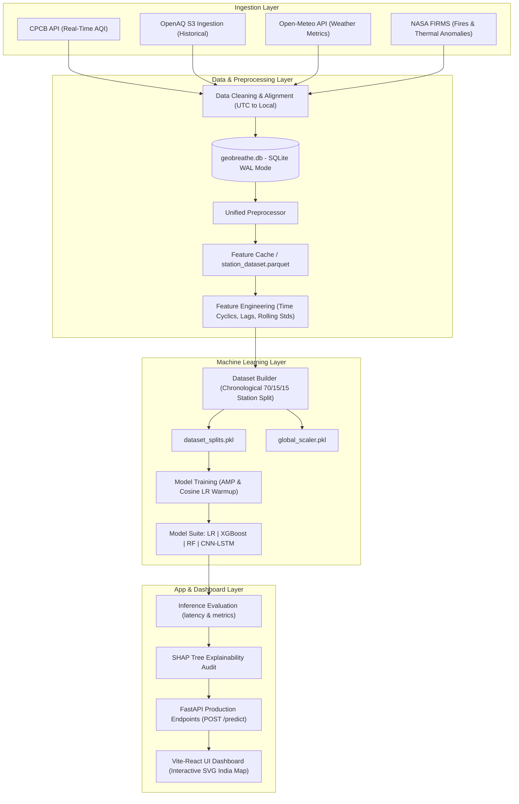

# AtmosEdgeAI System Documentation & Reference Manual

Welcome to the **AtmosEdgeAI System Documentation**. AtmosEdgeAI is a spatiotemporal deep learning air quality forecasting and source attribution engine designed for multi-station metropolitan environments in India.

---

## 1. System Architecture Diagram

Below is the end-to-end data ingestion, preprocessing, training, evaluation, and serving pipeline:

---

## 2. Problem Statement & Context

Air pollution is a critical public health crisis in India, particularly in cities like Delhi, Lucknow, and Bengaluru. NCAP (National Clean Air Programme) targets a 30-40% reduction in particulate concentrations by 2026. However, forecasting ambient air quality is notoriously challenging due to:
* **Complex Spatial Dispersion**: Pollution levels are highly localized, driven by wind direction and geographic boundaries.
* **Temporal Autoregression**: Local levels depend heavily on historical lags and rolling averages.
* **Regional Transport**: Biomass burning (e.g., agricultural stubble burning in Punjab/Haryana) carries smoke downwind, directly impacting cities hundreds of kilometers away.

---

## 3. Dataset & Data Collection

AtmosEdgeAI integrates three heterogeneous data sources into a centralized SQLite database (`geobreathe.db`):
1. **Air Quality (CPCB / OpenAQ)**: Ingests hourly PM2.5, PM10, NO2, SO2, O3, and CO records from 40 validated stations across India, tracking history from 2021 through 2026.
2. **Meteorology (Open-Meteo)**: Captures hourly values for temperature, relative humidity, wind speed, wind direction, and calculated wind stagnation.
3. **NASA FIRMS (Fires)**: Extracts thermal anomaly counts and radiative power (FRP) within a 150 km upwind radius of each station coordinates.

---

## 4. Feature Engineering

AtmosEdgeAI transforms raw data streams into a 41-dimensional feature matrix:
* **U/V Wind Vectors**: Converts polar wind speed and direction into orthogonal cartesian vectors ($u$-wind, $v$-wind) to represent physical transport vectors.
* **NASA FIRMS Upwind Index**: Multiplies fire count/intensity with downwind wind vectors to calculate the *Upwind Fire Transport Index*.
* **Cyclic Time Encodings**: Encodes Hour-of-Day and Day-of-Year as sine/cosine components to preserve boundary continuity (e.g., hour 23 wraps cleanly to hour 0).
* **Autoregressive Lags**: Calculates 1h, 2h, 3h, and 24h lags for PM2.5 and NO2.
* **Rolling Metrics**: Computes 6h, 12h, and 24h rolling means and standard deviations to capture baseline fluctuations.

---

## 5. Spatiotemporal Sequence Generator

* **Chronological Splits**: Performs a strict 70% Train, 15% Validation, and 15% Test chronological split per station. There is zero leakage from future sequences into evaluation splits.
* **Global Scale Consistency**: A single StandardScaler fits strictly on the combined training sets.
* **Sequence Shaping**: Sequences are packed into sliding blocks of length 24 (24 hours) for temporal inputs, combined with 3 static features (latitude, longitude, elevation).

---

## 6. Model Benchmarks & Leaderboard

The leaderboard rankings on the untouched **Test Set** containing **13,981 samples** are as follows:

| Rank | Model | Overall MAE | Overall RMSE | Model Size (MB) | Inference Latency (ms/sample) |
| :---: | :--- | :---: | :---: | :---: | :---: |
| 🥇 **1** | **Linear Regression (Best Baseline)** | **0.4880** | **0.7267** | 0.027 MB | 0.0018 ms |
| 🥈 **2** | **XGBoost Regressor** | **0.4965** | **0.7664** | 0.843 MB | 0.0140 ms |
| 🥉 **3** | **Persistence Baseline** | **0.5104** | **0.8226** | 0.000 MB | 0.0000 ms |
| 4 | **Random Forest Regressor** | 0.5171 | 0.7729 | 2.716 MB | 0.0052 ms |
| 5 | **CNN-LSTM Forecaster (Best Weights)** | 0.5570 | 0.8392 | 0.948 MB | 0.0408 ms |

---

## 7. Explainability Audit (SHAP on XGBoost)

* **Autoregression**: Current PM2.5 levels dominate predictions (high positive SHAP).
* **Fire Index**: NASA FIRMS upwind fires multiplied by wind direction show strong positive SHAP impact on forecast pollution spikes.
* **Inversion**: Low temperatures and high humidity have positive SHAP signs, capturing atmospheric boundary layer height contraction.

---

## 8. Deployment & REST API

The FastAPI service serves live predictions using lightweight models:
* `POST /predict`: Handles incoming payload and returns 24h forecasts, AQI category predictions, and safety alerts.
* `GET /stations`: Serves station directories with lat, lon, and live CPCB measurements.
* `GET /stations/{id}/forecast`: Multi-horizon (24/48/72h) predictions.
* `GET /feature-importance`: Global F-Score feature importances.
* `GET /monitoring`: System health telemetry (MAE, RMSE, drift metrics).

---

## 9. Limitations & Future Scope

1. **Temporal Covariate Shift**: Later test periods are colder, trapping more ambient particulates. Regular model retraining on a rolling 12-month window is required.
2. **Map Projection**: The SVG dashboard map uses a flat linear approximation of latitude/longitude. Implementing Mercator projection scaling would enhance visualization accuracy.
3. **Attribution Granularity**: Current physical attributions are static averages. Incorporating chemical transport models (like WRF-Chem) would provide real-time dynamic source tracking.
