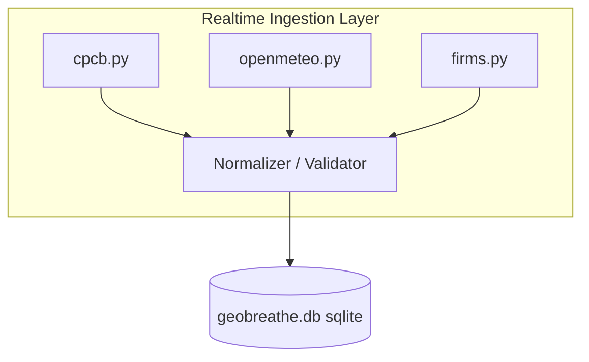

# Implementation Plan — Real-Time Production AI Transition

AtmosEdgeAI is transitioning from an offline research prototype into a production-grade, real-time AI forecasting platform. This implementation plan outlines the steps to build a robust real-time ingestion layer, unify the forecasting engine around the deployed Linear Regression baseline model, and refactor the Vite-React frontend into a professional modular structure.

---

## User Review Required

> [!IMPORTANT]
> The original PyTorch CNN-LSTM global forecaster will no longer be used for server-side forecasts in the dashboard. Instead, both the **Interactive Predictor** and the **Dashboard Views** will be unified to use the **same Linear Regression baseline model** (`baseline_lr.pkl`), which runs on-the-fly from live data.
> The historical parquet datasets will be kept strictly read-only for analytics, SHAP visualization, and model retraining purposes.

---

## Proposed Changes

### Component 1: Unified Forecasting Engine [NEW]

We will create a unified forecasting service inside `backend/app/services/forecasting/`. This service will load the deployed model (`baseline_lr.pkl`) and global scaler (`global_scaler.pkl`) **once at startup** and host preprocessing, feature engineering, and inference tasks.

#### [NEW] [inference.py](file:///c:/Users/praba/OneDrive/Desktop/AtmosEdgeAI/backend/app/services/forecasting/inference.py)
* Loads `baseline_lr.pkl` and `global_scaler.pkl` at module initialization.
* Handles inference calls. Expects a sequence of the last 24 hours of 41-dimensional features and the static variables of the target station.
* Computes forecast outputs (PM2.5 and NO₂ concentrations) for 24h, 48h, and 72h horizons.

#### [NEW] [feature_engineering.py](file:///c:/Users/praba/OneDrive/Desktop/AtmosEdgeAI/backend/app/services/forecasting/feature_engineering.py)
* Houses the feature construction pipeline:
  * Computes cyclic sine/cosine hour & day-of-year encodings.
  * Calculates seasons, rolling averages, rolling standard deviations (6h, 12h, 24h windows), and lag vectors (t-1, t-2, t-3, t-24).
  * Computes the NASA FIRMS upwind transport index using fire intensities and wind vectors.

#### [NEW] [preprocessing.py](file:///c:/Users/praba/OneDrive/Desktop/AtmosEdgeAI/backend/app/services/forecasting/preprocessing.py)
* Normalizes incoming temporal records column-wise using the loaded global scaler `scaler_X`.
* Normalizes static features (latitude, longitude, city_encoded) using `scaler_static`.
* Restores predicted values back to original space using `scaler_y`.

---

### Component 2: Real-Time Ingestion Layer [NEW]

We will establish a dedicated real-time data ingestion layer in `backend/app/services/ingestion/` to isolate external provider calls, handle validation, implement caching, and log failures.



#### [NEW] [cpcb.py](file:///c:/Users/praba/OneDrive/Desktop/AtmosEdgeAI/backend/app/services/ingestion/cpcb.py)
* Ingests latest air quality metrics for the 36 metropolitan stations.
* Implements retry logic and fallbacks if CPCB endpoints are slow or offline.

#### [NEW] [openmeteo.py](file:///c:/Users/praba/OneDrive/Desktop/AtmosEdgeAI/backend/app/services/ingestion/openmeteo.py)
* Ingests live weather forecasts and current conditions (temperature, humidity, wind vectors).

#### [NEW] [firms.py](file:///c:/Users/praba/OneDrive/Desktop/AtmosEdgeAI/backend/app/services/ingestion/firms.py)
* Ingests live MODIS/VIIRS fire coordinates. Uses regional local CSV databases as high-speed caches for offline execution.

#### [NEW] [scheduler.py](file:///c:/Users/praba/OneDrive/Desktop/AtmosEdgeAI/backend/app/services/ingestion/scheduler.py)
* Runs a cron task every hour to:
  * Query the live CPCB and weather metrics.
  * Validate and normalize readings.
  * Store the observations directly inside `geobreathe.db`.

#### [NEW] [cache.py](file:///c:/Users/praba/OneDrive/Desktop/AtmosEdgeAI/backend/app/services/ingestion/cache.py)
* Maintains a rolling cache of the last 72 hours of observations per station.
* Cleans and marks invalid or missing observations cleanly (rather than defaulting to fake averages).

---

### Component 3: Backend API Restructuring [MODIFY]

#### [MODIFY] [endpoints.py](file:///c:/Users/praba/OneDrive/Desktop/AtmosEdgeAI/backend/app/api/endpoints.py)
* Refactors `POST /api/predict` to require ONLY `"station_id"` and `"forecast_horizon"`. 
* The route will:
  1. Retrieve the last 24-hour observation sequence from the SQLite database.
  2. If the database has insufficient observations (<24 hours of data), return an **HTTP 422** error response.
  3. Otherwise, pass the sequence to the forecasting inference pipeline, apply scaling, predict the target concentrations, and return the forecast.
* Refactors `/stations/{id}/forecast` to execute the exact same Linear Regression inference pipeline instead of seasonal perturbation formulas.

---

### Component 4: Frontend Refactoring & Cleanup [MODIFY]

We will refactor the frontend codebase into a structured directories layout to separate concerns and clean up all dead code:

```
src/
  ├── components/
  │     ├── cards/          # Metrics and forecast cards
  │     ├── charts/         # SVG trends and heatmaps
  │     ├── layout/         # Header and drawer overlays
  │     ├── map/            # Leaflet dynamic map
  │     └── common/         # Alert banners
  ├── pages/
  │     ├── Dashboard.jsx   # Live dashboard
  │     ├── Predictor.jsx   # Real-time predictor form
  │     └── Landing.jsx     # Product homepage
  ├── services/
  │     └── api.js          # Unified axios/fetch clients
  ├── App.jsx               # Main state routing
  └── index.css             # Base styles
```

---

## Verification Plan

### Automated Tests
* Run api verify tests to hit `POST /api/predict` with only `station_id` and check that it pulls DB sequences, computes inference, and returns 200 OK.
* Verify `POST /api/predict` returns HTTP 422 when hitting an invalid station or a station with insufficient records.
* Build the frontend client to verify clean compile states.

### Manual Verification
* Validate map tiles swap correctly under Light/Dark themes.
* Verify the live status card displaying the data source ("Live", "Cached", "Historical") depending on database timestamps.
